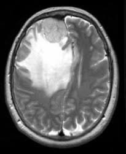

# Introduction

### Problem

The goal of this project is to develop a deep learning model that can accurately predict the presence of a brain tumor in MRI images. The model will take as input an MRI scan of a patient's brain and output a probability of the presence of a tumor. The model will be trained on a dataset of MRI images of both healthy brains and brains with tumors, and will be evaluated on a separate dataset to determine its accuracy in predicting brain tumors.


### Description
The project involved training a convolutional neural network (CNN) on a dataset of MRI images of both healthy brains and brains with tumors. The CNN trained to learn the features of a brain tumor, such as its shape and location, in order to make predictions on new MRI images. Also there is simple website made on Flask and bootstrap libraries that has a functionality to upload some MRI image of brain and get text result of model prediction.

By pressing “Predict!” button there will be an POST request on server where saved model is being loaded and using `model.predict()` method it gives a prediction on uploaded image:

- 0 - if there is no brain tumor
- 1 - otherwise.
And depending on this output there in website appears corresponding text.


# How to run

1. Type in your terminal:

   ```bash
   python mainTrain.py
   ```

   After executing command above you will see that there is new file named `BrainTumor20Epochs.h5`


2. Run your application by typing:

   ```bash
   python app.py
   ```
   It will run your server

3. Go to `http://127.0.0.1:5000` and enjoy :)

# Data and Methods

### Information about the data

Dataset is found on Kaggle.com and it contains 3060 images of brain MRI images which is divided into 3 folders:

- 1500 images with regular clear and healthy brain
- 1500 images with cancer brains
- 60 images in separate folder named “pred”




All images in .jpg format.
After downloading data as zip file I am processing it in following way:


And after dataset and labels are corresponds to each other I am splitting data into train and test sets with 80/20 proportion correspondingly(Pareto rule did not do anything, lol) using scikit-learn utility:


Description of the ML model
For this particular project I have used pretty average model that we have covered during lectures on CNN topic, also similar model been used in second assignment.
I have used Sequential model with 3 `Conv2D` convolutional layers and 3 `Pooling` layers with (3,3) pool. Also there is `Dropout` layer to prevent overfitting. Last one is `Dense` layer with 1 neuron and `sigmoid` activation function. There is only two possible outputs of our model, so for binary outputs it is more likely to use sigmoid function. Therefore, i have user binary_crossentropy in model.compile function.
To sum up everything that had been mentioned before, several convolutional layers extract features from the input image, pooling layers reduce the spatial dimensions of the output, a completely connected layer labels the features, and a dropout layer prevents overfitting.


# Results

After 10 epochs model has an accuracy of 96-98% and data loss that is in range 7-8%:


And this is how model works step-by-step:


Just for fun I tried to upload my photo and that is pretty funny, ahahah.


## Next steps

Next step is to master ML/DL skills, learn Data Sceince from scratch, because I am feeling lack of fundamental knowledge in this domain and make this project ready-to-use and integrate to hospitals on non-commercial base. I am planning to add some features like:
Cancer type classification
How much is it dangerous
What may be caused by this exact type of tumor
And so on...

## Useful links:

Dataset: https://www.kaggle.com/datasets/ahmedhamada0/brain-tumor-detection)

Telegram:
<https://t.me/boobieloverr>

LinkedIn:
<https://linkedin.com/in/islam-adilkhan>

Email:
adilkhanislam9@icloud.com
